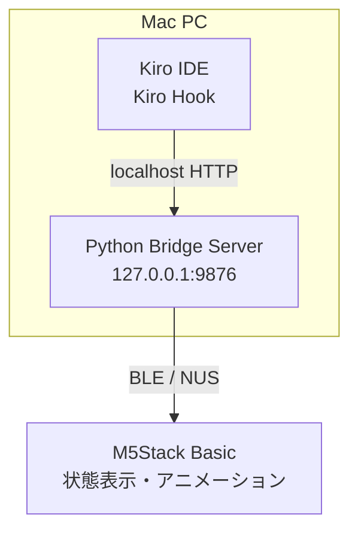

# Kiro Stack Buddy

Kiro IDEの作業状態をM5Stack Basicに表示する、小さなデスクコンパニオンです。

Kiro Stack Buddyは、Kiro IDEのワークスペースとM5Stack Basicを**Bluetooth Low Energy（BLE）**で接続します。ローカルBridgeがKiro Hookのイベントを受け取り、現在の作業状態をM5Stackへ送信します。M5Stack上では、状態に応じてKiroキャラクターのアニメーションが変化します。
PC画面ばかり見ずに、たまには物理世界にあるデバイス上でKiroを眺めませんか?少し癒されますよ。

> **Status:** 実験的な初期公開版です。現在はM5Stack BasicとMicroPythonを対象とし、macOSで動作確認しています。

## できること

- M5StackとはBLEで通信（HookからBridgeへはlocalhostのHTTPを使用し、Wi-Fiやクラウドサービスには依存しない）
- `127.0.0.1:9876`で動作するローカルHTTP Bridge
- 3つのKiro Hookによる状態連携
  - `SessionStart` → 待機
  - `UserPromptSubmit` → 作業中
  - `Stop` → 完了
- 状態に応じたKiroアニメーション
  - `idle`: その場で小さく左右に揺れる
  - `walk`: 作業中に画面内を左右へ移動する
  - `look`: その場で左右を見る
  - `completed`: 短時間上下に跳ねる
- BLE/Bridgeの接続状態を表示
- BLE切断時の自動再接続と最新状態の再送
- 標準Hook経路では、プロンプト本文、ファイル内容、コマンド本文、token使用量、credit使用量、セッションIDをM5Stackへ送信しない

## システム構成

Mac PC上でKiro IDEとPython製のBridgeサーバーを動かし、BridgeサーバーがM5Stack BasicとBLEで通信します。



- **Kiro IDE**：`SessionStart`、`UserPromptSubmit`、`Stop`などのHookイベントを発生させます。
- **Python Bridge Server**：Mac PCの`127.0.0.1:9876`でHTTPを待ち受け、Hookイベントを`idle`、`in_progress`、`completed`などの状態へ変換します。
- **M5Stack Basic**：BridgeとBLEで接続し、受信した状態に応じてKiroの画像とアニメーションを表示します。

Kiro IDEからBridgeまではMac PC内のlocalhost HTTP、BridgeからM5StackまではBLEを使用します。インターネット上のサーバーやクラウドサービスは経由しません。

## 必要なハードウェア

- M5Stack Basic / ESP32
- ファームウェア転送用のUSBケーブル
- Bluetooth Low Energyに対応したコンピューター

動作確認したファームウェア環境では、320×240のILI9342CディスプレイとMicroPython v1.25.0を使用しています。別のMicroPythonバージョンでの動作は未確認です。

## 必要なソフトウェア

### ホストコンピューター

- Kiro IDE
- Python 3.13以降
- [`uv`](https://docs.astral.sh/uv/)
- Bluetooth Low Energy対応
- `mpremote`（このプロジェクトでは`uv sync`によってインストールされます）

BridgeとHook連携はmacOSで動作確認済みです。LinuxとWindowsはまだ動作確認していません。ファームウェアのデプロイスクリプトはBashを使用するため、WindowsではWSLを使用するか、同等の`mpremote`コマンドを手動で実行してください。

### M5Stack

動作確認した環境では、M5Stack BasicへMicroPython v1.25.0をインストールしました。別のバージョンを使用する場合は、MicroPythonのBLE・GPIO・SPI APIとの互換性を確認してください。デプロイ中はM5StackをUSB接続します。

## インストール

リポジトリをクローンし、ホスト側の依存関係をインストールします。

```bash
git clone <YOUR_REPOSITORY_URL>
cd kiroStack
uv sync
```

`<YOUR_REPOSITORY_URL>`は実際のGitHubリポジトリURLに置き換えてください。

### 1. 画像をローカルで変換する

このリポジトリにはKiro画像を同梱していません。利用者自身が権利を確認した画像を用意し、ローカルでM5Stack用のBMPへ変換してください。スクリプトは外部URLから画像をダウンロードしません。

```bash
uv run python scripts/prepare_assets.py \
  --input /path/to/your-image.png
```

入力にはPNG、JPGなどPillowが読み込める画像を指定できます。スクリプトは画像を96×96へリサイズし、2値化して、次の2ファイルを生成します。

```text
firmware/assets/kiro_bw_96x96.bmp
firmware/assets/kiro_bw_96x96_left.bmp
```

入力画像の明るさに合わない場合は、2値化の閾値を調整できます。

```bash
uv run python scripts/prepare_assets.py \
  --input /path/to/your-image.png \
  --threshold 100
```

生成されたBMPはローカルで使用するためのファイルです。権利を確認していない画像をGitHubへcommitしたり、再配布したりしないでください。

### 2. ファームウェアをデプロイする

M5Stackのシリアルポートを確認し、次のコマンドを実行します。

```bash
./scripts/deploy.sh /dev/cu.usbserial-XXXX
```

Linuxでは、ポート名が`/dev/ttyUSB0`や`/dev/ttyACM0`になる場合があります。

デプロイスクリプトは次のファイルをM5Stackへ転送します。

```text
firmware/ili9342c.py
firmware/main.py
firmware/assets/kiro_bw_96x96.bmp
firmware/assets/kiro_bw_96x96_left.bmp
```

画像BMPが生成されていない場合、デプロイスクリプトはエラーを表示して停止します。転送後、スクリプトはM5Stackをリセットします。リセット後は、`KiroBuddy`としてBLE広告を開始できるよう、M5Stackの電源を入れたままにしてください。

### 3. BLE Bridgeを起動する

リポジトリのルートディレクトリから、ローカルBridgeを起動します。

```bash
./scripts/run_bridge.sh
```

または、次のコマンドでも起動できます。

```bash
uv run kiro-buddy-bridge
```

Bridgeは`http://127.0.0.1:9876`だけで待ち受け、M5StackをBLEで検索・接続し、接続後に最新状態を送信します。M5Stackが切断されると、自動的に再検索・再接続します。

macOSでBluetoothアクセスを求められた場合は許可してください。BridgeがM5Stackを検出できない場合は、M5Stackを再起動し、他のBLEクライアントが接続していないことを確認してください。

### 4. Kiro Hookを有効にする

このリポジトリには、ワークスペース用のHook設定が次の場所に含まれています。

```text
.kiro/hooks/buddy-state.json
```

このファイルには、次の3つのKiro IDE Hookが定義されています。

| Kiro Hook | HTTPイベント | デバイス状態 | アニメーション |
|---|---|---|---|
| `SessionStart` | `session_start` | `idle` | `idle` |
| `UserPromptSubmit` | `prompt_submit` | `in_progress` | `walk` |
| `Stop` | `stop` | `completed` | `completed` |

Kiro Hookのトリガー名はPascalCaseです。一方、ローカルBridgeへ送信するJSONイベント名はsnake_caseです。Hookの入力内容はBridgeへ転送しません。

Hook通知をM5Stackへ届けるには、Bridgeが起動済みである必要があります。Hook設定を変更した場合は、Kiro側でワークスペースHookが再読み込みされていることを確認してください。

## 画面表示と状態

| デバイス状態 | 表示 | アニメーション |
|---|---|---|
| BLE切断中 | `IDLE` + `BRIDGE OFFLINE` | `look` |
| `idle` | `IDLE` | `idle` |
| `in_progress` | `WORKING` | `walk` |
| `waiting_on_user` | `WAITING` | `look` |
| `completed` | 約2秒間`DONE` | `completed` |
| `error` | `ERROR` | `look` |

画面下部には、BLE/Bridge接続状態として`BLE: ON`または`BLE: OFF`と`BRIDGE CONNECTED`または`BRIDGE OFFLINE`を表示します。これらは同じBLEリンクの状態を示す表示です。

完了アニメーションは意図的に短く設定しています。約2秒後、別の状態を受信していなければファームウェアは`IDLE`へ戻ります。Bridgeは最新状態を保持し、BLE再接続後に再送します。ファームウェアはBLE切断時に受信済みsequenceをリセットするため、同じスナップショットを再適用できます。

### ボタン操作

- **ボタンB:** テスト用アニメーションを次の順番で切り替えます。

  ```text
  idle → walk → look → completed → idle
  ```

- **ボタンA/C:** BLE接続中に、テスト用の状態を次の順番で切り替えます。

  ```text
  idle → in_progress → waiting_on_user → completed → idle
  ```

  BLE未接続時は、メインループの接続状態処理によって`offline`表示へ戻ります。`error`はボタンテストの対象外です。

ボタンによるテストはファームウェア内だけで完結し、KiroやBridgeへイベントを送信しません。

## Bridgeの手動テスト

Bridgeの状態を確認します。

```bash
curl http://127.0.0.1:9876/status
```

Kiroの依頼開始をシミュレートします。

```bash
curl -X POST http://127.0.0.1:9876/event \
  -H "Content-Type: application/json" \
  -d '{"event":"prompt_submit"}'
```

Kiroのターン完了をシミュレートします。

```bash
curl -X POST http://127.0.0.1:9876/event \
  -H "Content-Type: application/json" \
  -d '{"event":"stop"}'
```

期待されるデバイスの状態遷移は次のとおりです。

```text
WORKING → DONE → IDLE
```

## BLEプロトコル

Bridgeとファームウェアは、Nordic UART Service（NUS）上で改行区切りのUTF-8 JSONを使って通信します。

状態メッセージの例：

```json
{
  "v": 1,
  "type": "state",
  "state": "in_progress",
  "message": "Working",
  "sequence": 3,
  "timestamp": 1720000000
}
```

BridgeはBLE書き込みを20バイト単位に分割します。M5Stackは新しい有効な状態メッセージを受け付けるとACKを返します。無効なJSONやsequenceにはエラー通知を返し、古いsequenceは無視します。ファームウェアは同じ接続中に適用済みのsequenceを無視し、BLE切断時にsequenceをリセットします。

## 開発・検証

リポジトリのルートディレクトリから、ホスト側のチェックを実行できます。

```bash
python3 -m py_compile firmware/main.py
python3 -m py_compile bridge/server.py
python3 -m py_compile scripts/ble_test_client.py
python3 -m py_compile scripts/prepare_assets.py
bash -n scripts/deploy.sh scripts/run_bridge.sh
python3 -c 'import json, pathlib; p=pathlib.Path(".kiro/hooks/buddy-state.json"); d=json.loads(p.read_text()); assert [h["trigger"] for h in d["hooks"]] == ["SessionStart", "UserPromptSubmit", "Stop"]; print("hooks: ok")'
git diff --check
```

スタンドアロンBLEテストクライアントは、`in_progress`状態をM5Stackへ直接送信します。

```bash
uv run python scripts/ble_test_client.py
```

このテストクライアントはKiro Hookの処理とは独立しています。BLE検出、接続、JSON受信、ACKの動作確認に利用できます。

## リポジトリ構成

```text
kiroStack/
├── .kiro/hooks/buddy-state.json       # Kiro IDE Hook設定
├── bridge/
│   ├── __init__.py
│   └── server.py                      # ローカルHTTP + BLE Bridge
├── documents/
│   ├── kiro-buddy-development.md     # 開発記録
│   └── kiro-buddy-development2.md    # 続編の開発記録
├── firmware/
│   ├── main.py                        # 表示、BLE Peripheral、アニメーション
│   ├── ili9342c.py                    # ILI9342C LCDドライバ
│   └── assets/                        # 利用者がローカル生成する画像素材
├── scripts/
│   ├── ble_test_client.py             # スタンドアロンBLEテストクライアント
│   ├── deploy.sh                      # ファームウェアデプロイ
│   ├── prepare_assets.py              # ローカル画像のBMP変換
│   └── run_bridge.sh                  # Bridge起動ヘルパー
├── pyproject.toml
├── uv.lock
├── LICENSE
└── README.md
```

## プライバシーと対象範囲

Kiro Stack Buddyは、ローカルで作業状態だけを表示するためのプロジェクトです。標準Hook経路では、ローカルBridgeからM5Stackへ、`idle`、`in_progress`、`completed`などの正規化された状態をBLEで送信します。Bridgeにはデバッグ用の`/send`エンドポイントもあり、任意のJSONを送信できるため、機密情報を含むデータは送らないでください。BLE接続時には状態とは別に時刻同期メッセージも送信します。

標準Hook経路では、次の情報をM5Stackへ送信・表示しません。

- プロンプト本文
- ファイル名やファイル内容
- コマンド本文
- token使用量やcredit使用量
- セッションID
- 詳細ログ

Bridgeはループバックアドレス（`127.0.0.1`）でのみ待ち受け、インターネットへ公開するHTTPサーバーではありません。BLEは現在認証されていないため、周囲からのBLEアクセスが問題になる環境では使用しないでください。

## 第三者アセットと商標

画像の取得元や利用条件は利用者自身で確認してください。例えば、[LobeHubのKiroアイコンページ](https://lobehub.com/icons/kiro)から取得した画像を使う場合、RGB565 BMPへ変換しても元画像やKiro商標に関する権利は消滅しません。

- [LobeHubの`lobe-icons`リポジトリ](https://github.com/lobehub/lobe-icons)はMIT Licenseで公開されています。
- LobeHubのアイコンページには、画像が著作権で保護されている可能性がある旨が記載されています。
- KiroはAWSの商標です。詳細は[AWS Trademark Guidelines](https://aws.amazon.com/trademark-guidelines/)を確認してください。

LobeHubソフトウェアリポジトリのMITライセンスは、Kiro商標や元画像を改変・再配布できることの確認として解釈しないでください。本プロジェクトは非公式であり、AWSまたはKiroとは提携・承認関係にありません。

権利を確認していない画像をGitHubへcommitしたり、他人へ再配布したりしないでください。画像の利用条件は利用者の責任で確認してください。

## 既知の制限

- 動作確認済みのハードウェアはM5Stack Basicのみです。
- 動作確認済みのホストOSはmacOSのみです。
- Kiro IDE Hookが必要です。他のエディター用の汎用アクティビティモニターではありません。
- `waiting_on_user`と`error`はプロトコルに実装されていますが、現在の標準3 Hookからは生成されません。
- ファームウェアデプロイスクリプトにはUnix系シェルが必要です。


## ライセンス

本リポジトリのオリジナルソースコードおよび関連ドキュメントは、MIT Licenseで公開します。詳細は[`LICENSE`](LICENSE)を参照してください。

MIT Licenseは、本リポジトリに含まれるオリジナルコードと関連ドキュメントに適用されます。以下はこのライセンスの対象外です。

- 利用者が用意する画像
- 第三者が提供する画像やアセット
- Kiro、AWS、M5Stackなどの名称、ロゴ、商標
- Pillow、Bleak、aiohttp、mpremoteなどの依存ライブラリおよび外部ソフトウェア

第三者のアセットや商標を利用する場合は、それぞれの権利者が定める利用条件を確認してください。KiroおよびAWS関連の名称・商標は、それぞれの権利者に帰属します。
