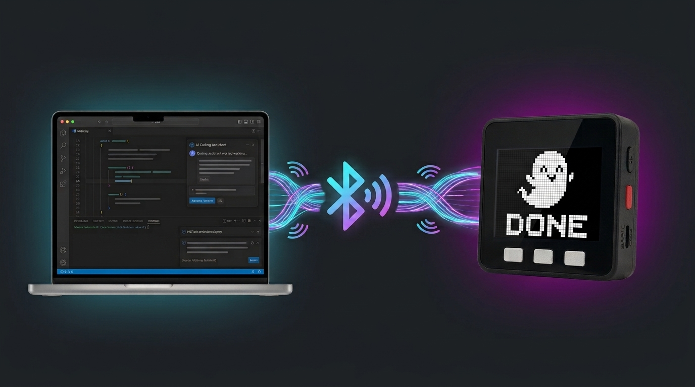
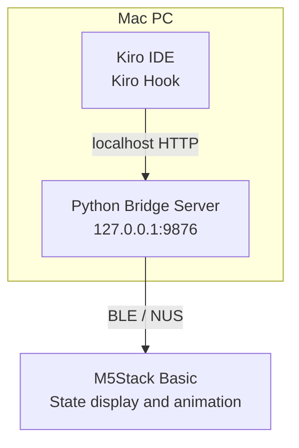
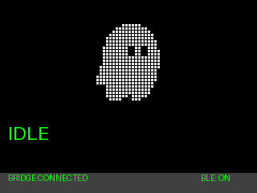
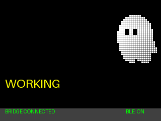
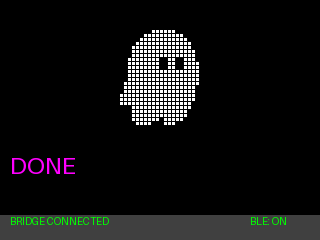
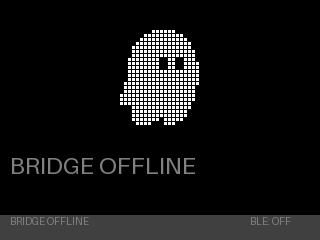

# Kiro Stack Buddy



[日本語](README.ja.md) | English

Kiro Stack Buddy is a device project that displays Kiro IDE activity on an M5Stack Basic.

Kiro Stack Buddy connects a Kiro IDE workspace and an M5Stack Basic over **Bluetooth Low Energy (BLE)**. A local Bridge receives Kiro Hook events and sends the current activity state to the M5Stack. The M5Stack changes the Kiro character animation according to the state.

> **Status:** Experimental early release. Currently targets M5Stack Basic and MicroPython, and has been tested on macOS.

## Features

- BLE communication with the M5Stack; Hooks communicate with the Bridge over localhost HTTP, without Wi-Fi or cloud services
- Local HTTP Bridge listening on `127.0.0.1:9876`
- State integration through three Kiro Hooks:
  - `SessionStart` → idle
  - `UserPromptSubmit` → in progress
  - `Stop` → completed
- State-based Kiro animations:
  - `idle`: small side-to-side sway
  - `walk`: appears at the right edge, looks left and right in place for about 200ms, walks left for five 12px steps and right for five steps at about 50ms per step, disappears at the right edge, then repeats the same look-and-walk sequence from the left edge in the opposite direction
  - `look`: looks from side to side in place
  - `completed`: briefly bounces up and down
- The Kiro image is rendered as 24×24 logical pixels, enlarged to 96×96 with nearest-neighbor scaling, and separated by a 1px black grid
- Status labels such as `IDLE`, `WORKING`, and `DONE` keep the existing text rendering
- BLE/Bridge connection status display
- Automatic BLE reconnection and latest-state resend
- Through the standard Hook path, prompt text, file contents, command text, token usage, credit usage, and session IDs are not sent to the M5Stack

## System architecture

Kiro IDE and the Python Bridge server run on the Mac. The Bridge server communicates with the M5Stack Basic over BLE.



- **Kiro IDE:** Generates Hook events such as `SessionStart`, `UserPromptSubmit`, and `Stop`.
- **Python Bridge Server:** Listens on `127.0.0.1:9876` on the Mac and converts Hook events into states such as `idle`, `in_progress`, and `completed`.
- **M5Stack Basic:** Connects to the Bridge over BLE and displays the Kiro image and animation for the received state.

Kiro IDE communicates with the Bridge over localhost HTTP on the Mac, and the Bridge communicates with the M5Stack over BLE. No Internet server or cloud service is involved.

## Hardware requirements

- M5Stack Basic / ESP32
- USB cable for firmware transfer
- A computer with Bluetooth Low Energy support

The tested firmware environment uses a 320×240 ILI9342C display and MicroPython v1.25.0. Other MicroPython versions have not been tested.

## Software requirements

### Host computer

- Kiro IDE
- Python 3.13 or later
- [`uv`](https://docs.astral.sh/uv/)
- Bluetooth Low Energy support
- `mpremote` (installed by `uv sync` in this project)

The Bridge and Hook integration have been tested on macOS. Linux and Windows have not been tested. The firmware deployment script uses Bash; on Windows, use WSL or run equivalent `mpremote` commands manually.

### M5Stack

The tested environment uses MicroPython v1.25.0 on an M5Stack Basic. To preserve free ESP32 memory, the firmware initializes BLE before loading the 96×96 BMP data into memory. If you use another version, verify compatibility with the MicroPython BLE, GPIO, and SPI APIs. Keep the M5Stack connected over USB during deployment.

## Installation

Clone the repository and install the host dependencies:

```bash
git clone <YOUR_REPOSITORY_URL>
cd kiroStack
uv sync
```

Replace `<YOUR_REPOSITORY_URL>` with the actual GitHub repository URL.

### 1. Included assets

The Kiro pixel-art BMP files are included in the repository. After cloning and running `uv sync`, no image download or conversion is required; deploy directly by providing the M5Stack serial port.

The included assets are:

```text
firmware/assets/kiro_bw_96x96.bmp
firmware/assets/kiro_bw_96x96_left.bmp
```

Only the Kiro image is pixelated. Status labels such as `IDLE`, `WORKING`, and `DONE` keep the firmware's existing text rendering.

#### Optional: use a custom image

If you want to use a custom image, prepare one for which you have verified the usage rights and convert it locally into M5Stack-compatible BMP files. The script does not download images from external URLs.

```bash
uv run python scripts/prepare_assets.py \
  --input /path/to/your-image.png \
  --logical-size 24 \
  --pixel-gap 1
```

You can provide PNG, JPG, or other formats supported by Pillow. The image is converted into 24×24 logical pixels and enlarged to 96×96 with nearest-neighbor scaling. `--logical-size` must divide 96. `--pixel-gap 0` removes the black gap between logical pixels. If the source Kiro image is black on a light or transparent background, add `--invert` to output a white Kiro on a black background. If the brightness is unsuitable, adjust the threshold with an option such as `--threshold 100`.

Do not commit or redistribute custom BMP files or images whose rights you have not verified.

### 2. Deploy the firmware

Find the M5Stack serial port and pass it explicitly to the deployment script.

macOS example:

```bash
./scripts/deploy.sh /dev/cu.usbserial-XXXX
```

Linux example:

```bash
./scripts/deploy.sh /dev/ttyACM0
```

Replace the example with the actual serial port on your system.

The deployment script transfers these files to the M5Stack:

```text
firmware/ili9342c.py
firmware/main.py
firmware/assets/kiro_bw_96x96.bmp
firmware/assets/kiro_bw_96x96_left.bmp
```

If the bundled BMP files are missing, the deployment script stops with an error. Confirm that you cloned the repository correctly and that both files exist in `firmware/assets/`. It resets the M5Stack after transfer. Keep the M5Stack powered on so that it can advertise over BLE as `KiroBuddy`.

### 3. Start the BLE Bridge

From the repository root, start the local Bridge:

```bash
./scripts/run_bridge.sh
```

Alternatively:

```bash
uv run kiro-buddy-bridge
```

The Bridge listens only on `http://127.0.0.1:9876`, scans for and connects to the M5Stack over BLE, and sends the latest state after connection. It automatically scans and reconnects after a disconnect.

On macOS, allow Bluetooth access if prompted. If the Bridge cannot find the M5Stack, restart the M5Stack and make sure no other BLE client is connected to it.

### 4. Enable the Kiro Hooks

This repository includes the workspace Hook configuration at:

```text
.kiro/hooks/buddy-state.json
```

The file defines these three Kiro IDE Hooks:

| Kiro Hook | HTTP event | Device state | Animation |
|---|---|---|---|
| `SessionStart` | `session_start` | `idle` | `idle` |
| `UserPromptSubmit` | `prompt_submit` | `in_progress` | `walk` |
| `Stop` | `stop` | `completed` | `completed` |

Hook trigger names use PascalCase, while the JSON event names sent to the local Bridge use snake_case. Hook input content is not forwarded to the Bridge.

The Bridge must be running for Hook notifications to reach the M5Stack. If you change the Hook configuration, make sure the workspace Hooks have been reloaded by Kiro.

## Display states

| Device state | Display | Animation |
|---|---|---|
| BLE disconnected | `IDLE` + `BRIDGE OFFLINE` | `look` |
| `idle` | `IDLE` | `idle` |
| `in_progress` | `WORKING` | `walk` |
| `waiting_on_user` | `WAITING` | `look` |
| `completed` | `DONE` for about two seconds | `completed` |
| `error` | `ERROR` | `look` |

The bottom of the display shows `BLE: ON` or `BLE: OFF` and `BRIDGE CONNECTED` or `BRIDGE OFFLINE`. Both labels represent the same BLE link state.

### Animation previews

#### IDLE



#### WORKING



#### DONE



#### BRIDGE OFFLINE



The completion animation is intentionally brief. After about two seconds, the firmware returns to `IDLE` unless another state has been received. The Bridge keeps the latest state and resends it after a BLE reconnection. The firmware resets its received sequence on disconnect so the same snapshot can be applied again.

### Button controls

- **Button B:** Cycles through the test animation patterns:

  ```text
  idle → walk → look → completed → idle
  ```

- **Buttons A/C:** While BLE is connected, cycles through test states:

  ```text
  idle → in_progress → waiting_on_user → completed → idle
  ```

  When BLE is disconnected, the main loop returns the display to `offline`. The `error` state is not included in button testing.

Button testing is handled entirely by the firmware and does not send events to Kiro or the Bridge.

## Manual Bridge testing

Check the Bridge status:

```bash
curl http://127.0.0.1:9876/status
```

Simulate the start of a Kiro request:

```bash
curl -X POST http://127.0.0.1:9876/event \
  -H "Content-Type: application/json" \
  -d '{"event":"prompt_submit"}'
```

Simulate the end of a Kiro turn:

```bash
curl -X POST http://127.0.0.1:9876/event \
  -H "Content-Type: application/json" \
  -d '{"event":"stop"}'
```

Expected device state transition:

```text
WORKING → DONE → IDLE
```

## BLE protocol

The Bridge and firmware communicate over the Nordic UART Service (NUS) using newline-delimited UTF-8 JSON.

Example state message:

```json
{
  "v": 1,
  "type": "state",
  "state": "in_progress",
  "message": "Working",
  "sequence": 3,
  "timestamp": 1720000000
}
```

The Bridge splits BLE writes into 20-byte chunks. The M5Stack sends an ACK when it accepts a new, valid state message. Invalid JSON or sequence values produce an error notification, and older sequences are ignored. The firmware ignores an already-applied sequence during the same connection and resets the sequence on BLE disconnect.

## Development and validation

From the repository root, run the host-side checks:

```bash
python3 -m py_compile firmware/main.py
python3 -m py_compile bridge/server.py
python3 -m py_compile scripts/ble_test_client.py
python3 -m py_compile scripts/prepare_assets.py
bash -n scripts/deploy.sh scripts/run_bridge.sh
python3 -c 'import json, pathlib; p=pathlib.Path(".kiro/hooks/buddy-state.json"); d=json.loads(p.read_text()); assert [h["trigger"] for h in d["hooks"]] == ["SessionStart", "UserPromptSubmit", "Stop"]; print("hooks: ok")'
git diff --check
```

The standalone BLE test client sends the `in_progress` state directly to the M5Stack:

```bash
uv run python scripts/ble_test_client.py
```

This test client is independent of Kiro Hook processing and can be used to test BLE discovery, connection, JSON reception, and ACK behavior.

## Repository layout

```text
kiroStack/
├── .kiro/hooks/buddy-state.json       # Kiro IDE Hook configuration
├── bridge/
│   ├── __init__.py
│   └── server.py                      # Local HTTP + BLE Bridge
├── documents/
│   ├── kiro-buddy-development.md     # Development notes
│   └── kiro-buddy-development2.md    # Follow-up development notes
├── firmware/
│   ├── main.py                        # Display, BLE peripheral, animation
│   ├── ili9342c.py                    # ILI9342C LCD driver
│   └── assets/                        # Bundled pixel-art BMP assets
├── scripts/
│   ├── ble_test_client.py             # Standalone BLE test client
│   ├── deploy.sh                      # Firmware deployment
│   ├── prepare_assets.py              # Local image-to-BMP conversion
│   └── run_bridge.sh                  # Bridge startup helper
├── pyproject.toml
├── uv.lock
├── LICENSE
├── README.md
└── README.ja.md
```

## Privacy and scope

Kiro Stack Buddy is a local project for displaying activity state. Through the standard Hook path, the local Bridge sends normalized states such as `idle`, `in_progress`, and `completed` to the M5Stack over BLE. The Bridge also provides a debug `/send` endpoint that can send arbitrary JSON, so do not send sensitive data through it. A separate time synchronization message is also sent when the BLE connection is established.

Through the standard Hook path, the following information is not sent to or displayed on the M5Stack:

- Prompt text
- File names or file contents
- Command text
- Token or credit usage
- Session IDs
- Detailed logs

The Bridge listens only on the loopback address (`127.0.0.1`) and is not an Internet-facing HTTP server. BLE is currently unauthenticated; do not use it in environments where nearby BLE access is a concern.

## Third-party assets and trademarks

Check the source and usage terms of any image you provide. For example, if you use an image obtained from the [LobeHub Kiro icon page](https://lobehub.com/icons/kiro), converting it to an RGB565 BMP does not remove rights associated with the original image or the Kiro trademark.

- Kiro is an AWS trademark. See the [AWS Trademark Guidelines](https://aws.amazon.com/trademark-guidelines/).

This is an unofficial project and is not affiliated with or endorsed by AWS or Kiro.

Do not commit or redistribute images whose rights you have not verified. Users are responsible for checking the terms for their chosen images.

## Known limitations

- Only M5Stack Basic has been tested.
- Only macOS has been tested as the host OS.
- Kiro IDE Hooks are required; this is not a generic activity monitor for other editors.
- `waiting_on_user` and `error` are implemented in the protocol but are not generated by the current standard three Hooks.
- The firmware deployment script requires a Unix-like shell.

## License

The original source code and related documentation in this repository are released under the MIT License. See [`LICENSE`](LICENSE).

The MIT License applies to the original code and related documentation in this repository. It does not apply to:

- Images provided by users
- Images or assets provided by third parties
- Names, logos, and trademarks such as Kiro, AWS, and M5Stack
- Dependencies and external software such as Pillow, Bleak, aiohttp, and mpremote

Check the terms set by the respective rights holders when using third-party assets or trademarks. Kiro and AWS-related names and trademarks belong to their respective rights holders.
